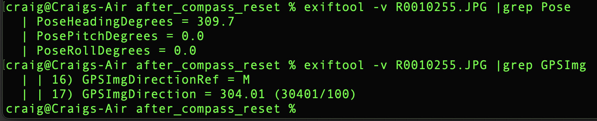
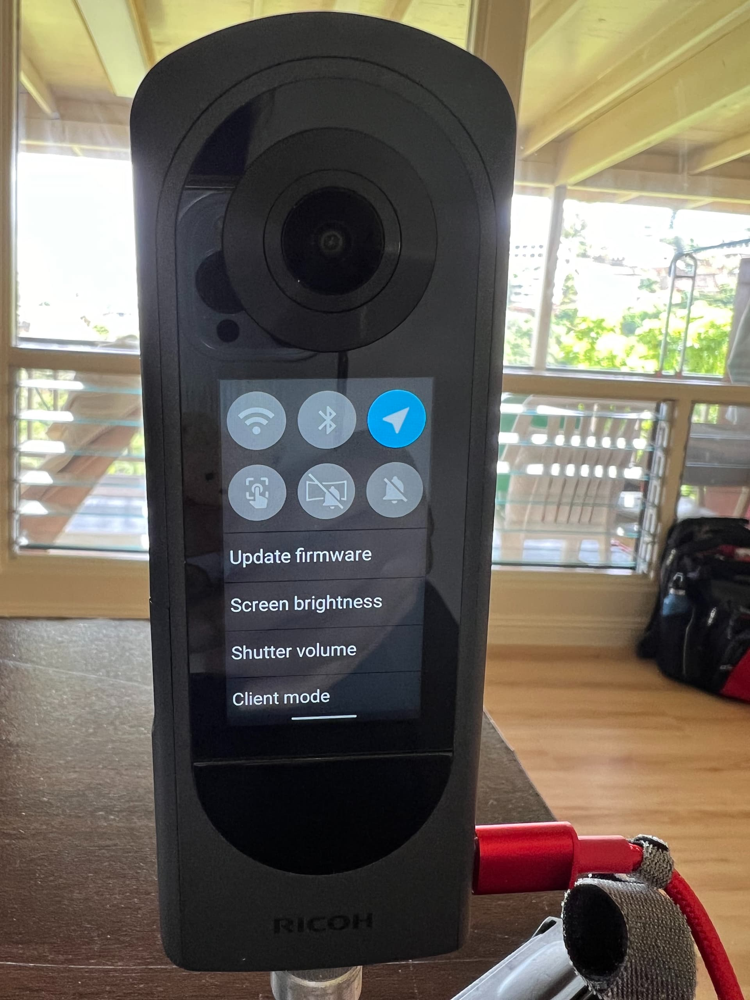
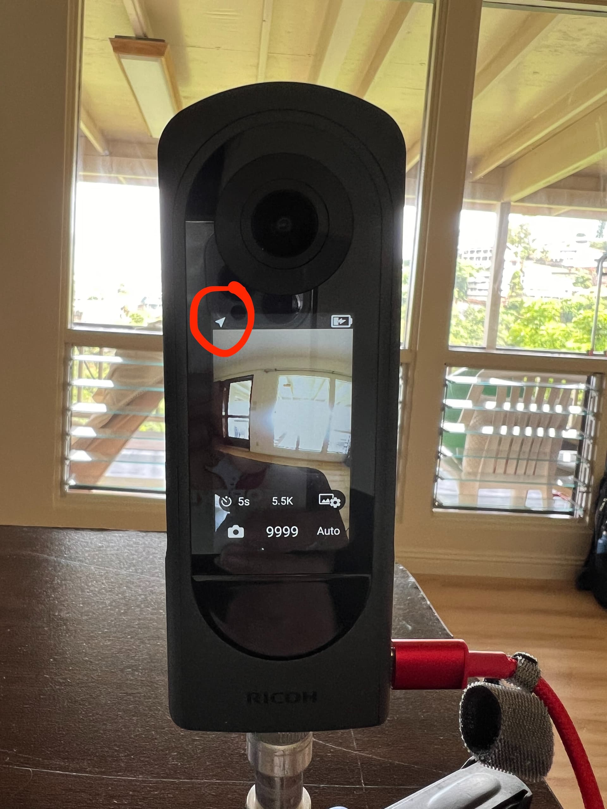
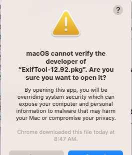
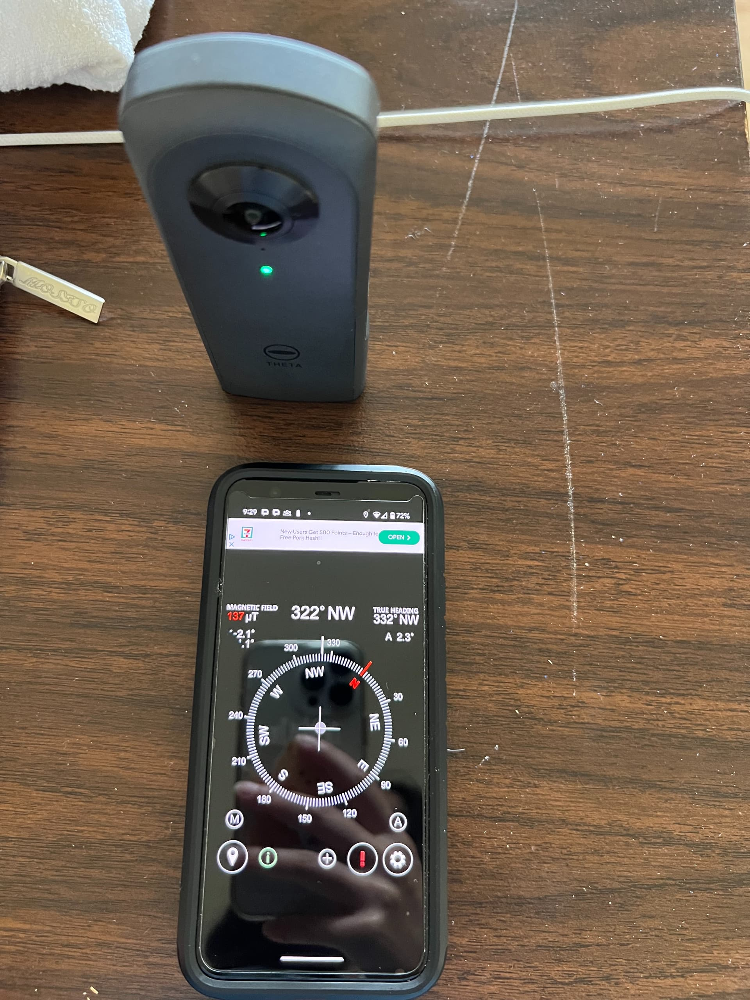
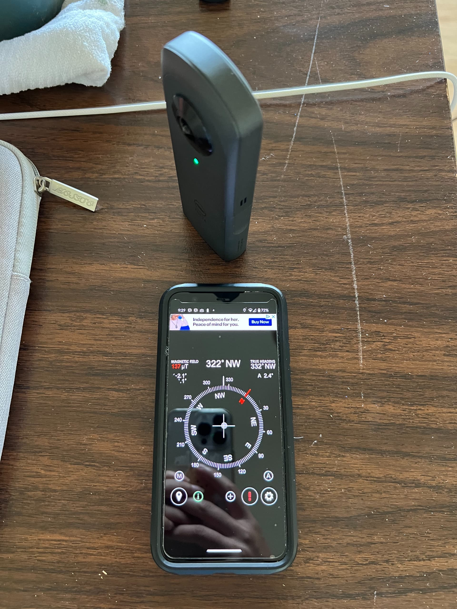
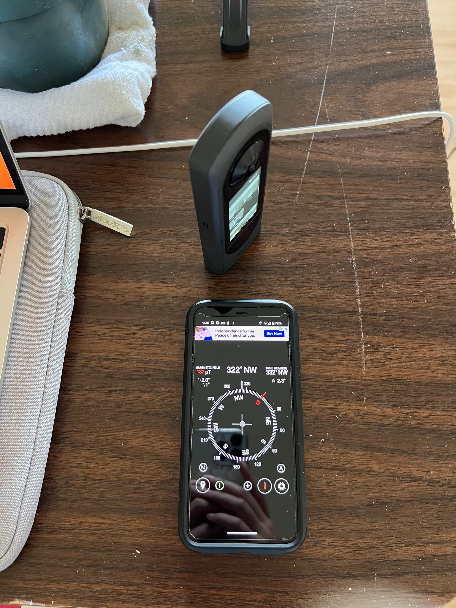
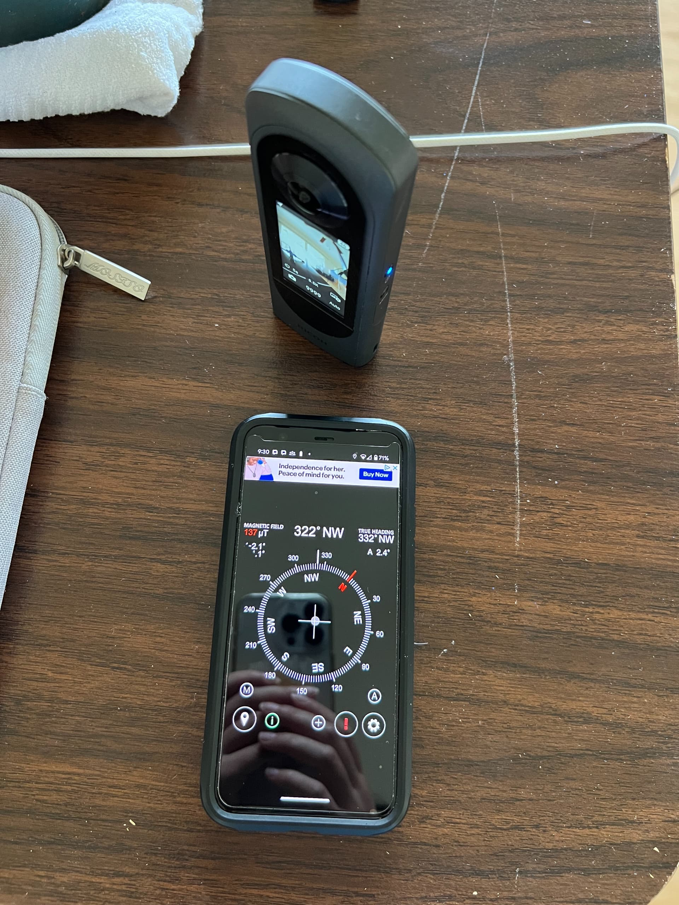
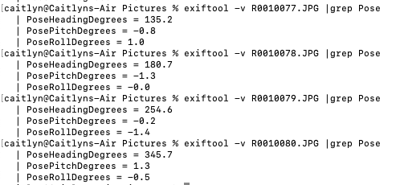

# Internal Compass and Camera Orientation

## Compass Recalibration

RICOH THETA cameras include an internal compass that will record the camera orientation.
If the compass requires calibration, no compass information will be recorded.

This is the expected metadata from the RICOH THETA X using the internal GPS. No mobile app, just the camera.

To recalibrate the compass, use a figure 8 motion shown in these videos: [Z1](https://youtu.be/Q9e7FoWYRY8),
[X](https://youtu.be/6UX2QBLjZbE).

## Pose Metadata

Refer to the [Google Spherical Metadata specification](https://developers.google.com/streetview/spherical-metadata)
for information on the metadata needed for Streetview
placement.

## TopBottomCorrection

The camera will automatically level the image using internal sensors.
For the Z1, only still images are supported.  For the X, both still images and video are supported.
The behavior is controlled with this API
[_topBottomCorrection](https://github.com/ricohapi/theta-api-specs/blob/main/theta-web-api-v2.1/options/_top_bottom_correction.md).

In addition, the X can perform topBottomCorrection on live preview: [community link](https://community.theta360.guide/t/is-it-possible-to-get-ricoh-camera-orientation-from-live-preview/9510/6?u=craig) and [additional community information on topBottomCorrection](https://community.theta360.guide/t/ricoh-theta-disable-auto-level-topbottomcorrection-for-interval-shooting/9338?u=craig).

## Testing PoseHeadingDegrees with THETA X

_Testing provided by community member [@caitlyn](https://community.theta360.guide/u/caitlyn/summary)_

<h2>Test Environment</h2>

* Exiftool version - 12.92
* Ricoh THETA X firmware version - 2.50.2
* Mac OS version - Ventura 13.6.7
* Condition of camera - GPS is **on** (solid, white logo appears in top left corner), bluetooth and wifi disabled
* ImageCapture app to transfer photos

<h2>Additional Testing</h2>

I conducted additional testing on the internal GPS of the Ricoh THETA X to try to retrieve the PoseHeadingDegrees. Here are the steps and challenges I ultimately ran into to get the data.

1) Ensure that the Location Setting of the Ricoh camera is turned on before taking a picture. You should see the location icon on the upper left-hand corner of the Ricoh THETA X.

2) Capture a picture and transfer it to your computer. I'm using a Mac and found that the Pose information only appeared if I transferred the picture using the **[ImageCapture app](https://support.apple.com/guide/image-capture/transfer-images-imgcp1003/mac)**. The Photos app on the Mac seems to strip out the GPS data.

3) Download and install the **[ExifTool](https://exiftool.org/install.html)** version 12.92 which is used to read metadata from the files. If using a Mac, you may have to bypass the security notification during installation.

4) In the location of your downloaded photos, the command

`exiftool -v R0010255.JPG |grep Pose`

should display the Pose data now.

5) To test if the Pose data updates, we took 360 pictures while rotating the camera around a pivot. Below, are the values for PoseHeadingDegrees, PosePitchDegrees, and PoseRollDegrees from the image data which update as the position of the camera changes.

<h2>Other Problems</h2>

* On one of the cameras we were testing on, we had to reset the settings because the GPS icon did not appear even after enabling the icon. It's key that the icon appears as a solid, white logo and not an outline in the corner.
* The Mac photos app and Ricoh File transfer app doesn't work for retrieving the GPS information for the camera. Instead, use the Image Capture app if on a Mac.
