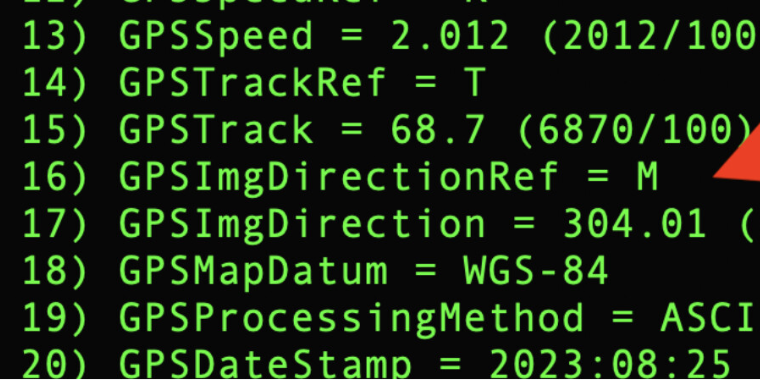
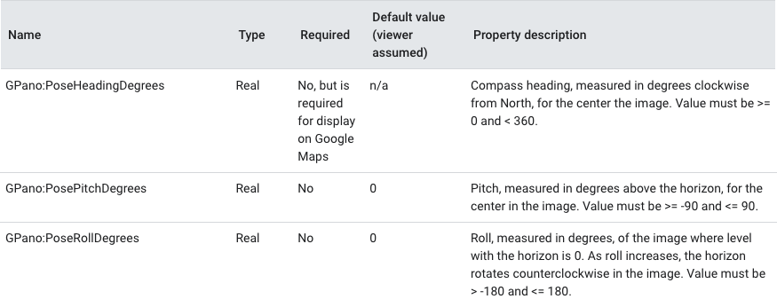
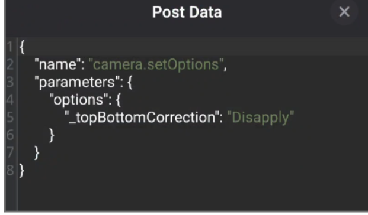

# Internal Compass and Camera Orientation

RICOH THETA cameras include an internal compass that will record the camera orientation.
If the compass requires calibration, no compass information will be recorded.

To recalibrate the compass, use a figure 8 motion shown in these videos: [Z1](https://youtu.be/Q9e7FoWYRY8),
[X](https://youtu.be/6UX2QBLjZbE).

## Pose Metadata

Refer to the [Google Spherical Metadata specification](https://developers.google.com/streetview/spherical-metadata)
for information on the metadata needed for Streetview
placement.

## TopBottomCorrection

The camera will automatically level the image using internal sensors.
For the Z1, only still images are supported.  For the X, both still images and video are supported.
The behavior is controlled with this API
[_topBottomCorrection](https://github.com/ricohapi/theta-api-specs/blob/main/theta-web-api-v2.1/options/_top_bottom_correction.md).

In addition, the X can perform topBottomCorrection on live preview: [community link](https://community.theta360.guide/t/is-it-possible-to-get-ricoh-camera-orientation-from-live-preview/9510/6?u=craig) and [additional community information on topBottomCorrection](https://community.theta360.guide/t/ricoh-theta-disable-auto-level-topbottomcorrection-for-interval-shooting/9338?u=craig).

