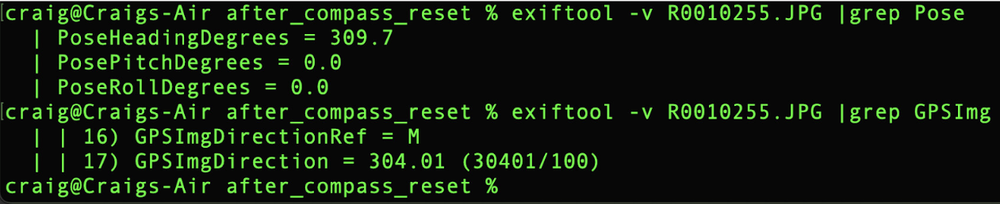
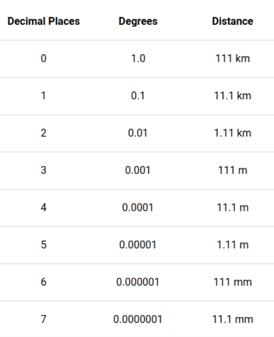

# GPS Accuracy and Metadata

The location accuracy of GIS chips of most mobile phones - and also the THETA X chip - vary based on satellite location and other factors.  The [US government official site on GPS](https://www.gps.gov/systems/gps/performance/accuracy/) indicates that mobile phones can provide 5m accuracy under an open sky. As a rough guide, the THETA X can be grouped with similar accuracy of mobile phones.

There are two strategies to store higher accuracy:

1. use an external GPS with higher accuracy and store it in a separate log file.  Match the GPS timestamp with the timestamp of the THETA images or video frames (in CaMM data in certain formats).
2. store GPS information in the image metadata of each image.

GPS location stored in the RICOH THETA image metadata is in the Exif IFD format, which has the following accuracy:  Lat/Lng dd/1 mm/1 ss/100.  This is roughly equivalent to 30cm.

## Degree Decimal Accuracy

Although the GPS location information is stored as
dd, mm, ss, the input to the API is in decimal.

The chart below provides a rough approximation. However,
keep in mind that the conversion to seconds to comply
with the IFD Exif metadata format will result in a loss
of accuracy.

## Add GPS Information To Image Metadata

In typical use, a mobile phone GPS sends location information to the Z1 and interfaces with the camera using an API to save the GPS information.

[GPS Information](https://github.com/ricohapi/theta-api-specs/blob/main/theta-web-api-v2.1/options/gps_info.md)

Note that mobile phone GPS units are accurate to approximately 5m.  Even if there is greater apparent accuracy stored in the image metadata using the API, the actual accuracy is limited to the GPS unit, meaning that the input data from the mobile phone or onboard GPS could be less accurate than the numbers stored in the metadata.
