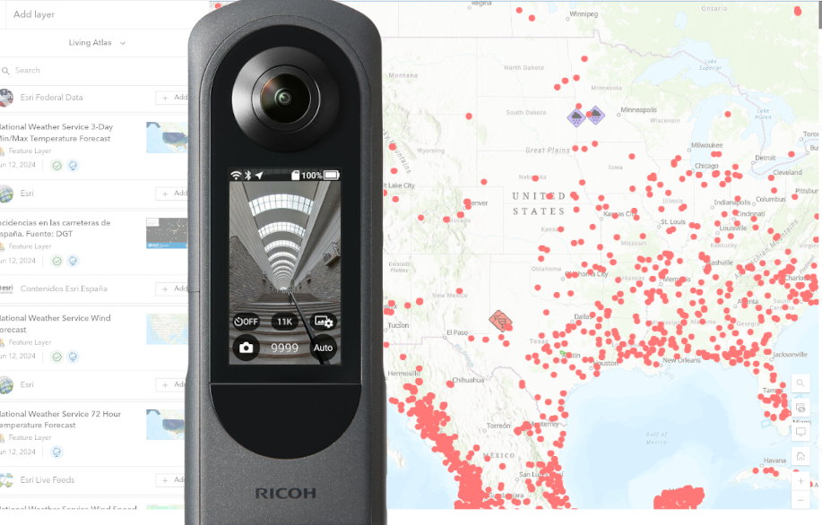
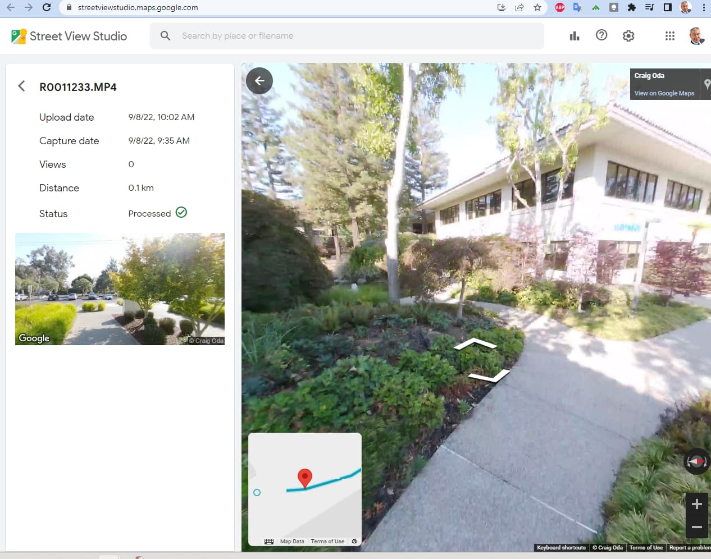
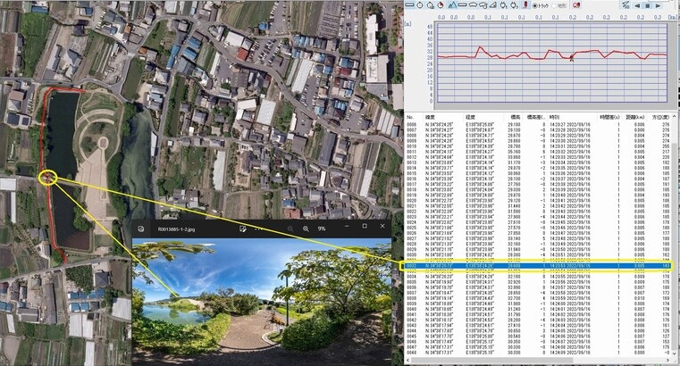

# RICOH THETA GPS and IMU Sensors

RICOH THETA cameras are widely used to document the condition
of streets,  buildings, trails, power lines, construction
sites and other types of infrastructure. THETA 360° images
are used in virtual tours or overlayed onto maps.

Excellent image quality, low cost, and ease-of-use make RICOH
THETA cameras an excellent choice for projects requiring
visual documentation of large areas.  

In addition to taking single and interval images, people also
use video frame extraction to easily take thousands of images.

## Video Frame Extraction Example

In the example below, 8K 360° video is taken at 10fps by simply walking
around with the camera held overhead. The individual frames
are automatically placed on a map using the internal GPS data,
compass, and orientation sensor data.

## Process to Attach GPS Data to 360° Images

| Shooting Method | Where GPS Data is Saved | How GPS Data is Recorded |
| -------- | ----------- | --------- |
| Z1  single or interval shooting of indoor / outdoor still images on map | metadata in [Exif](https://en.wikipedia.org/wiki/Exif) format  Easy to extract | THETA WebAPI accepts GPS data |
| X single or interval shooting | metadata in Exif format | X internal GPS technology can write metadata inside of camera.  Alternately, the same API as the Z1 can be used to write coordinates |
| 8K video frame extraction | Data is stored in a separate [CaMM](https://developers.google.com/streetview/publish/camm-spec) track and needs to be matched | X has 8K low fps video with onboard GPS and IMU stored in video metadata |

## Still Image and Separate GPS Data File Example

The example below is from community member Toyo Fujita.

