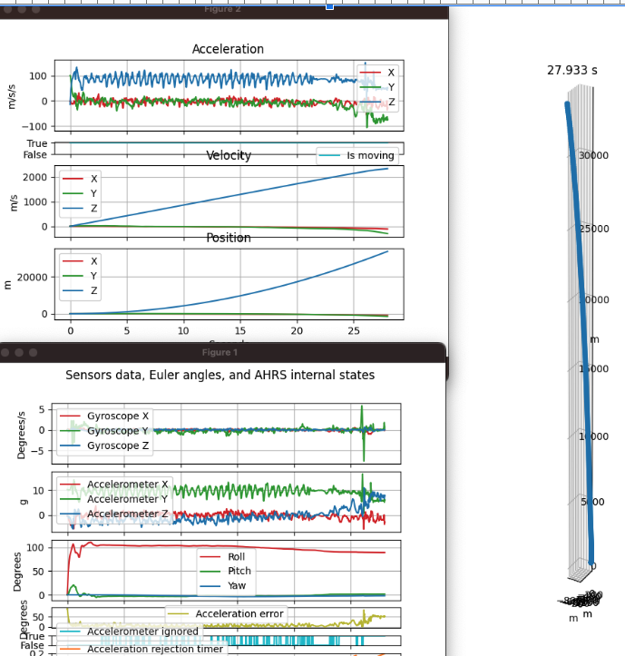

# Video Metadata



CaMM Data in Videos

* [Official THETA Metadata Specification](https://github.com/ricohapi/theta-api-specs/blob/main/theta-metadata/README.md)
* THETA X stores IMU data in CaMM format
* [Community example of extracting data](https://community.theta360.guide/t/imu-data-libraries/9176?u=craig)
* [GitHub](https://github.com/monschine/extract_camm/)
* Note that the example on the right was produced with a Z1 using a special two fisheye video format specified
[here](https://github.com/ricohapi/theta-api-specs/blob/main/theta-web-api-v2.1/options/file_format.md)

## Using exiftool

```text
exiftool -ee -V3 path/to/your/video.MP4 > path/to/results.txt
```

Output

```text
Track2 Type='camm' Format='camm', Sample 1 of 3642 (16 bytes)
 147e567: 00 00 02 00 00 00 00 00 00 00 00 00 00 00 00 00 [................]
SampleTime = 0
SampleDuration = 0
camm2 (SubDirectory) -->
- Tag 'camm' (16 bytes):
 147e567: 00 00 02 00 00 00 00 00 00 00 00 00 00 00 00 00 [................]
+ [BinaryData directory, 16 bytes]
| AngularVelocity = 0 0 0
| - Tag 0x0004 (12 bytes, float[3]):
|  147e56b: 00 00 00 00 00 00 00 00 00 00 00 00             [............]
Track2 Type='camm' Format='camm', Sample 2 of 3642 (16 bytes)
 147e577: 00 00 03 00 00 13 c7 3f c0 27 9e 40 00 28 e3 3d [.......?.'.@.(.=]
SampleTime = 0
SampleDuration = 0.005
camm3 (SubDirectory) -->
- Tag 'camm' (16 bytes):
 147e577: 00 00 03 00 00 13 c7 3f c0 27 9e 40 00 28 e3 3d [.......?.'.@.(.=]
+ [BinaryData directory, 16 bytes]
| Acceleration = 1.55526733398438 4.94235229492188 0.110916137695312
| - Tag 0x0004 (12 bytes, float[3]):
|  147e57b: 00 13 c7 3f c0 27 9e 40 00 28 e3 3d             [...?.'.@.(.=]
```

## Z1 CaMM Data


[community information on single-fisheye dual video recording](https://community.theta360.guide/t/ricoh-theta-z1-firmware-3-01-1-adds-single-fisheye-simultaneous-recording-of-2-videos-50min-video-length/9095?u=craig)

Z1 is capable of an unusual video format that produces 2 single fisheye videos with CaMM data.  The videos need to be stitched in the customer’s own cloud.  RICOH does not provide an SDK or example for the stitching.  However, lens information is available to help with the process.
