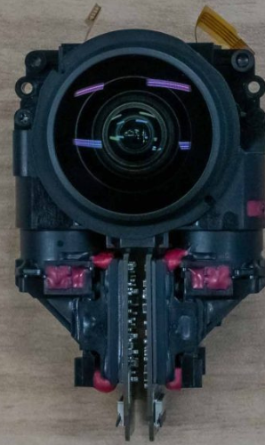

# Developer Resources

Our active camera [developer community](https://community.theta360.guide/) is the best way to get started.

If you have any questions about finding information, please
post in the community.  We are friendly people.

## RICOH Specifications

* Open [camera API](https://github.com/ricohapi/theta-api-specs)
* Open video [metadata specs](https://github.com/ricohapi/theta-api-specs/tree/main/theta-metadata)
* Camera body [CAD files available](https://pages.ricoh360.com/theta-3d-data) (for bracket construction)
* [THETA Lens Specification](https://github.com/ricohapi/theta-api-specs/tree/main/theta-lens) - useful for companies designing their own stitching software or building photogrammetry applications.

## RICOH Open Source SDKs

| project | description |
| ---- | ----------- |
| [theta-client](https://github.com/ricohapi/theta-client) | mobile app development to connect with camera via WiFi |
| [theta-plugin-sdk](https://github.com/ricohapi/theta-plugin-sdk) | runs app inside camera on internal Android OS |

## RICOH APIs

There are 4 different API categories to meet the requirements
of different workflows.

| API Category | Description |
| -------- | --------- |
| [WebAPI](https://github.com/ricohapi/theta-api-specs/tree/main/theta-web-api-v2.1)   | Most commonly-used API.  Uses WiFi in either 2.4GHz or 5GHz using a REST-like HTTP protocol. Camera can either function as the hotspot or connect to a router (V, X, Z1 only). X also works with Ethernet |
| [Plugin API](https://github.com/ricohapi/theta-api-specs/tree/main/ricoh-theta-plugin) | The camera runs Android OS internally. Using Android development tools, businesses can build applications that run completely inside the camera  |
| [USB API](https://github.com/ricohapi/theta-api-specs/tree/main/theta-usb-api) | Communicate with camera using a USB cable that can also supply power to the camera. Uses MTP protocol. |
| [Bluetooth API](https://github.com/ricohapi/theta-api-specs/tree/main/theta-bluetooth-api) | Limited API to run a subset of commands over BLE. Use WiFi instead of Bluetooth if your application permits it |

