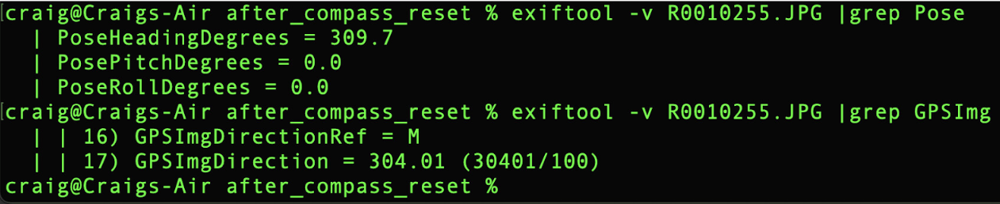

# Sensor Data in Image Metadata

For still images, sensor data is stored in the metadata of the image

Cameras have the following internal sensors:

* accelerometer
* gyroscope
* electronic compass

In addition, the THETA X has internal GPS
The data is written into the image metadata and can be read and written with a number of free tools, including [exiftool](https://exiftool.org/).

This is an example of the GPS data from the RICOH THETA X
stored in Exif IFD format.

The example below shows shooting at 6 second intervals using
the THETA X interval mode. The camera mounted on a monopod
and held overhead.  A selfie-stick with a 1/4" mount on top will
also work.

As a quick test of GPS accuracy, I used exiftool to extract
the coordinates from the metadata and then plotted the image
locations on Google Maps.

I also repeated the test with a Z1 using my mobile phone's GPS
to embed the location into the image metadata.

