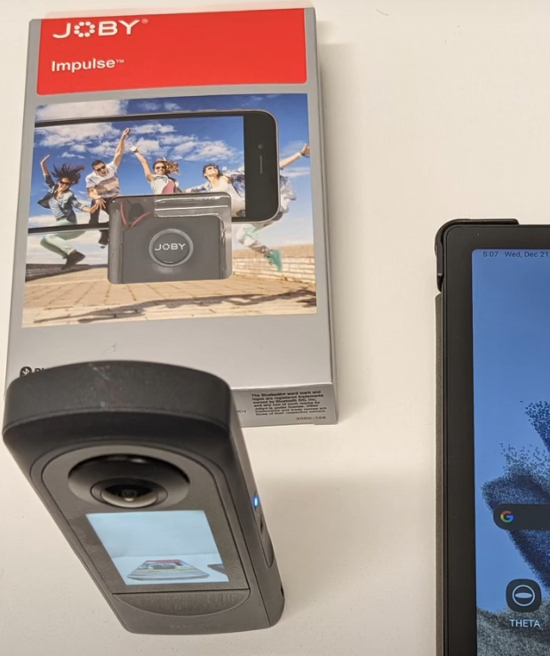

# Starting Video

The video for most file formats can be started
through the API.  8K video cannot be started
with the API.  You can use a bluetooth clicker.

* [Bluetooth Clicker Operates at 8K video at 2, 5, 10 fps](https://community.theta360.guide/t/8k-5-fps-street-view-video-mode/9493/9?u=craig)
[video](https://youtu.be/Xu0Ca5VubBw?feature=shared) (Joby Impulse.  There is also official RICOH bluetooth clicker)
* [2 hour long 8K and 5.7K videos](https://community.theta360.guide/t/2-hour-360-videos-with-ricoh-theta-x-low-fps-at-5-7k-and-8k/8998?u=craig)

## APIs - WebAPI

* [startCapture](https://github.com/ricohapi/theta-api-specs/blob/main/theta-web-api-v2.1/commands/camera.start_capture.md)
* [stopCapture](https://github.com/ricohapi/theta-api-specs/blob/main/theta-web-api-v2.1/commands/camera.stop_capture.md)
* [fileFormat](https://github.com/ricohapi/theta-api-specs/blob/main/theta-web-api-v2.1/options/file_format.md)
