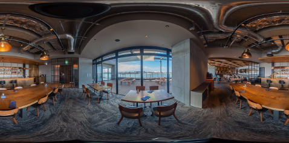
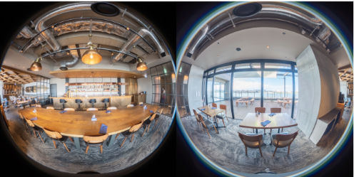

# Stitching

Still image and video stitching can be done in the camera.

## Equirectangular

## Dual-fisheye

## APIs to control stitching

* [_imageStitching](https://github.com/ricohapi/theta-api-specs/blob/main/theta-web-api-v2.1/options/_image_stitching.md)
* [videoStitching](https://github.com/ricohapi/theta-api-specs/blob/main/theta-web-api-v2.1/options/video_stitching.md)

In addition, the image stitching has many options for static, dynamic, and sequence stitching.
