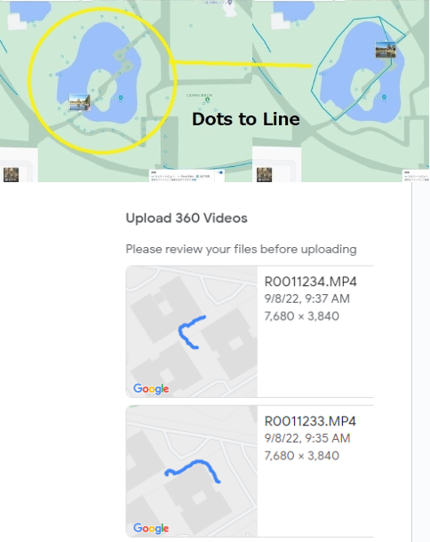

# RICOH THETA Use Cases

* Mapping trails
* Landslides on roads
* Oil and Gas pipelines
* Mapping sidewalks
* Checking power lines
* Sewer pipe and manhole inspection
* Drainage channel, Storm inlets

## Broad Areas

* Architecture, engineering, construction
* Federal government
* Emergency management
* Law enforcement

## Credits

Thank you to these community members for contributing
to these use case examples.

* [Nodeology](https://www.nodeology.net/) provides high-level geospatial technology services, including enterprise implementations, systems engineering, software development, workflow design, process automation, and more!
* [POSM Software LLC](https://posmsoftware.com/) provides efficient and user-friendly sewer, storm drain, manhole, well, and pipeline data collection and management solutions. Since 2000, they've been committed to delivering reliable software, exceptional real-time technical support, and seamless integration with most inspection systems in today's market.
* [TREKK Design Group](https://gotrekk360.com/) - Conduct safer and more efficient remote inspections, leveraging 360-degree camera technology where humans once ventured on tethers and safety cables.  The old way of inspecting wastewater and stormwater assets is officially obsolete
