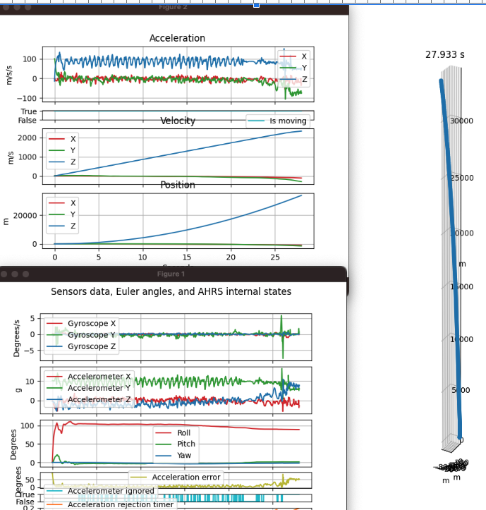
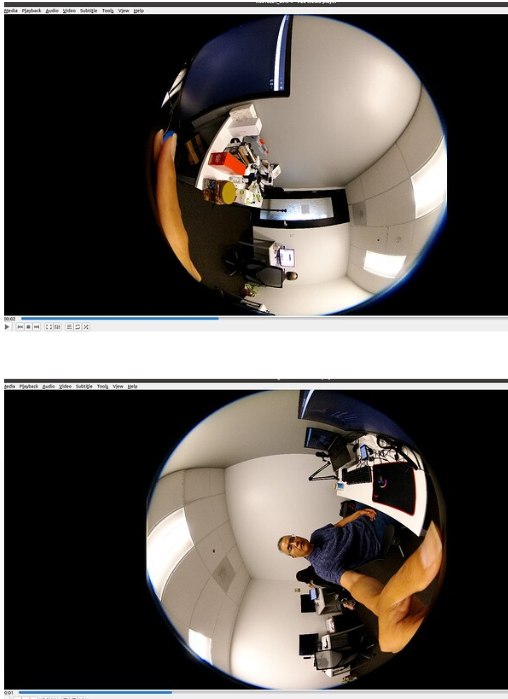

# RICOH THETA Video



## CaMM Data in Videos

* [Official THETA Metadata Specification](https://github.com/ricohapi/theta-api-specs/blob/main/theta-metadata/README.md)
* THETA X stores IMU data in CaMM format
* [Community example of extracting data](https://community.theta360.guide/t/imu-data-libraries/9176?u=craig)
* [GitHub](https://github.com/monschine/extract_camm/)
* Note that the example above was produced with a Z1 using a special two fisheye video format specified
[here](https://github.com/ricohapi/theta-api-specs/blob/main/theta-web-api-v2.1/options/file_format.md)

### Using exiftool

```text
exiftool -ee -V3 path/to/your/video.MP4 > path/to/results.txt
```

Output

```text
Track2 Type='camm' Format='camm', Sample 1 of 3642 (16 bytes)
 147e567: 00 00 02 00 00 00 00 00 00 00 00 00 00 00 00 00 [................]
SampleTime = 0
SampleDuration = 0
camm2 (SubDirectory) -->
- Tag 'camm' (16 bytes):
 147e567: 00 00 02 00 00 00 00 00 00 00 00 00 00 00 00 00 [................]
+ [BinaryData directory, 16 bytes]
| AngularVelocity = 0 0 0
| - Tag 0x0004 (12 bytes, float[3]):
|  147e56b: 00 00 00 00 00 00 00 00 00 00 00 00             [............]
Track2 Type='camm' Format='camm', Sample 2 of 3642 (16 bytes)
 147e577: 00 00 03 00 00 13 c7 3f c0 27 9e 40 00 28 e3 3d [.......?.'.@.(.=]
SampleTime = 0
SampleDuration = 0.005
camm3 (SubDirectory) -->
- Tag 'camm' (16 bytes):
 147e577: 00 00 03 00 00 13 c7 3f c0 27 9e 40 00 28 e3 3d [.......?.'.@.(.=]
+ [BinaryData directory, 16 bytes]
| Acceleration = 1.55526733398438 4.94235229492188 0.110916137695312
| - Tag 0x0004 (12 bytes, float[3]):
|  147e57b: 00 13 c7 3f c0 27 9e 40 00 28 e3 3d             [...?.'.@.(.=]
```

### Z1 CaMM Data



[community information on single-fisheye dual video recording](https://community.theta360.guide/t/ricoh-theta-z1-firmware-3-01-1-adds-single-fisheye-simultaneous-recording-of-2-videos-50min-video-length/9095?u=craig)

Z1 is capable of an unusual video format that produces 2 single fisheye videos with CaMM data.  The videos need to be stitched in the customer’s own cloud.  RICOH does not provide an SDK or example for the stitching.  However, lens information is available to help with the process.

## Auto-Level

In the THETA X, video [_topBottomCorrection](https://github.com/ricohapi/theta-api-specs/blob/main/theta-web-api-v2.1/options/_top_bottom_correction.md) can be controlled with the THETA API. If set to on, the video will be processed inside
the camera to auto-level the video.

If you intend to upload the THETA X video to Google Street View with [Street View Studio](https://streetviewstudio.maps.google.com/), community members recommend that `_topBottomCorrection` be enabled.  As of September 2024, it does
not appear that Google Street View Studio handles level correction post-processing based on the IMU sensor data.

If you plan to handle level compensation in your own application or want the original camera orientation in the
video frames, then turn `_topBottomCorrection` off.

## Comparing 8K and 5.7K

Available video file formats are listed [in the official THETA API documentation](https://github.com/ricohapi/theta-api-specs/blob/main/theta-web-api-v2.1/options/file_format.md). In addition to 8K at 10fps, 5fps, and 2fps, there is also 5.7K video at low framerates.

Although the 8K video offers higher resolution, there are tradeoffs to consider before immediately
jumping to the 8K video format.

The 5.7K video offers a smaller video size. Community tests suggest that the 5.7K video is around 30% of the 8K video. Smaller file sizes may be useful in reducing
data transmission times or hardware requirements for video processing.

The 5.7K video also consumes less power, increasing battery use of the RICOH THETA X.  Community
tests show that the 5.7K 2fps video consumes 2.5W compared to 3.4W for 8K 2fps.

Finally, from THETA X firmware v2.51.0, the 5.7K 2/5/10fps video enables TNR
(temporal noise reduction), which balances resolution and noise.

!!! warning
    File size and power consumptiion are estimates based on community testing.  The community
    information on power consumption and file size in this document are not official
    camera specifications from RICOH.  Please contact RICOH for official information
    on the RICOH THETA camera.

## Video Frame Extraction

There are many solutions to extract video frames.
ffmpeg is a popular open source package.  There's an [example of
video frame extraction](https://community.theta360.guide/t/video-frame-extraction-with-ffmpeg/7738?u=craig)
in the community.
